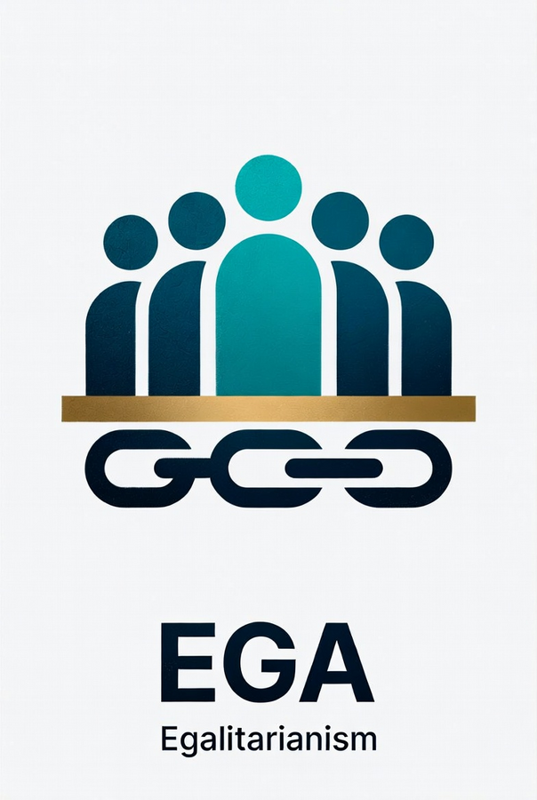

# EGA (Egalitarianism) Core

<p align="center">
  
</p>

Privacy-respecting, egalitarian **Proof-of-Work** full node — forked from DigiByte Core and rebuilt for fair access.

**Coin icon** (`logo/coinlogo.jpg`) · **Brand / chain mark** (`logo/blockchainlogo.jpg`)

**Anyone with ordinary hardware can mine:** phones, laptops, old PCs, Raspberry Pis, consumer GPUs.  
**No premine.** Diversified PoW so one hardware class cannot easily own the chain.

---

## Frozen network parameters

| Parameter | Value |
|-----------|--------|
| Max supply | **21,000,000,000** EGA |
| Decimals | **8** |
| Block subsidy | **50,000** EGA, halvings every **210,000** blocks |
| Block time | **60 seconds** (overall) |
| Premine | **0** |
| PoW | **RandomX** + **Verthash** + **YespowerEGA** (from genesis) |
| Difficulty | **MultiShield** (V4-style) from height 0 |
| Main P2P / RPC | **20201** / **20202** |
| Magic | `e4 47 41 01` (main) |
| bech32 HRP | `ega` |
| Data directory | `~/.ega` |
| Config file | `ega.conf` |

Full tables: [`docs/ega/params.md`](docs/ega/params.md) · design: [`docs/ega/design.md`](docs/ega/design.md)

### Mining algorithms

| Algo | Best for |
|------|----------|
| **RandomX** | Modern CPUs, phones, Pi with enough RAM |
| **Verthash** | Consumer GPUs (EGA 256 MiB dataset) |
| **YespowerEGA** | Old phones, low-RAM Pi (`N=2048`, `r=32`, personalization `YespowerEGA`) |

MultiShield keeps independent difficulty per algo (~⅓ share each).

---

## Status

Phases **1–6** of the foundation plan are implemented:

1. Economy (21B, 8 decimals, subsidy, 60s)  
2. Network identity (ports, magic, addresses, empty seeds)  
3. Triple PoW + MultiShield  
4. Genesis freeze (real RandomX work)  
5. Product surface (datadir/conf, wrappers, this README)  
6. Tests + hardening; **Linux + Windows** build docs (**macOS deferred**)

Still welcome: explorer, pool, Qt installers, RandomX full-dataset mode, macOS, deeper cleanup of DigiByte packaging. See [docs/ega/ECOSYSTEM.md](docs/ega/ECOSYSTEM.md).

---

## Building

```bash
./autogen.sh   # if needed
# Mining node (recommended):
./configure --with-daemon --without-gui --enable-wallet --with-incompatible-bdb
# Optional desktop wallet:
# ./configure --with-daemon --with-gui=qt5 --enable-wallet --with-incompatible-bdb
make -j$(nproc)
```

Outputs: **`src/egad`**, **`src/ega-cli`**, **`src/ega-tx`** (and **`src/qt/ega-qt`** if GUI enabled).

| Component | Status |
|-----------|--------|
| CLI node + wallet RPC | **Works** |
| GUI (`ega-qt`) | Build with Qt5; not default |
| Explorer / stratum pool | Separate apps — [ECOSYSTEM.md](docs/ega/ECOSYSTEM.md) |

**Platforms:** [Linux](docs/ega/build-linux.md) · [Windows](docs/ega/build-windows.md) · macOS deferred  

**cmake** required for RandomX.

---

## Running

### Easiest path (Linux)

```bash
bash scripts/easy-install-linux.sh
bash scripts/easy-start.sh
bash scripts/easy-wallet.sh
bash scripts/easy-mine.sh randomx
```

Desktop menu apps (Wallet / Node / Miner):

```bash
bash scripts/install-desktop-apps.sh
```

Two miners, one chain (local proof):

```bash
bash scripts/two-node-mining-demo.sh
```

Getting started: [docs/ega/getting-started.md](docs/ega/getting-started.md) · Network mining: [docs/ega/network-mining.md](docs/ega/network-mining.md) · Handoff: [EGA-HANDOFF.txt](EGA-HANDOFF.txt)


```bash
./src/egad -daemon
./src/ega-cli getblockchaininfo
```

Example config: [`share/examples/ega.conf`](share/examples/ega.conf) → `~/.ega/ega.conf`.

Regtest smoke:

```bash
datadir=$(mktemp -d)
./src/egad -regtest -datadir="$datadir" -daemon
./src/ega-cli -regtest -datadir="$datadir" getblockhash 0
# expect 7db0bcedfac1596d0be2a5b42c4b88043c207f8f29bac2796fba10ea06ae5ac0
./src/ega-cli -regtest -datadir="$datadir" stop
```

---

## License

MIT. See [COPYING](COPYING). Based on DigiByte / Bitcoin Core; EGA-specific work is additive.

---

## Launch (nodes + mining)

**Operator guide:** [docs/ega/USER-GUIDE-LAUNCH.md](docs/ega/USER-GUIDE-LAUNCH.md)  
**Launch checklist:** [docs/ega/LAUNCH.md](docs/ega/LAUNCH.md)
**Status & roadmap:** [docs/ega/STATUS-AND-ROADMAP.md](docs/ega/STATUS-AND-ROADMAP.md)  
**Whitepaper (draft):** [docs/ega/WHITEPAPER.md](docs/ega/WHITEPAPER.md)
**All GitHub repos:** [docs/ega/REPOS.md](docs/ega/REPOS.md)

Recommended configure for mining:

```bash
./configure --with-daemon --without-gui --enable-wallet --with-incompatible-bdb
make -j$(nproc)
```

## Tests

```bash
./configure --enable-tests --without-gui --enable-wallet --with-incompatible-bdb
make -C src test/test_digibyte -j$(nproc)
./src/test/test_digibyte -t main_tests -t ega_pow_tests -t amount_tests
./docs/ega/smoke-regtest.sh
./docs/ega/mine-all-algos-regtest.sh
```

## Contributing

See [CONTRIBUTING.md](CONTRIBUTING.md) and the phased notes under [`docs/ega/`](docs/ega/).
